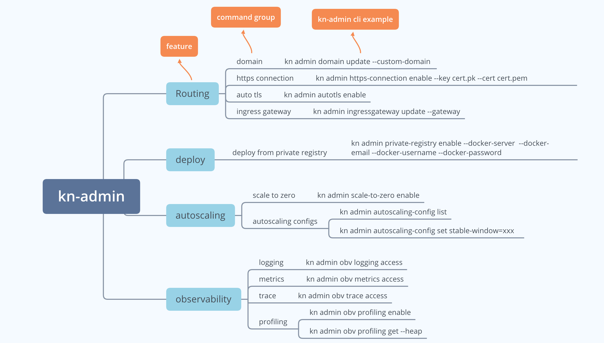

# kn-admin
A plugin for kn client for management
It is used to help administrators or operators to manage Knative platform with kn CLI and make their lives easier, like feature flags enablement or disablement, instead of many manual steps like modifying several of ConfigMaps or yaml files to update one config or feature.


* Note: This repo is under development.

## kn-admin Design


## kn-admin Usage
```bash
$ kn admin -h
A plugin of kn client to manage Knative for administrators.

For example:
kn admin domain set - to set Knative route domain to a custom domain
kn admin https-connection enable - to enable https connection for Knative Service
kn admin private-registry enable - to enable deployment from the private registry
kn admin scale-to-zero enable - to enable scale to zero
kn admin obv profiling get -heap - to get Knative Serving profiling data

Usage:
  admin [command]

Available Commands:
  autoscaling      Manage autoscaling config
  autotls          Manage autotls with Cert Manager
  domain           Manage route domain
  help             Help about any command
  https-connection Manage https connection for Service
  ingressgateway   Manage ingress gateway
  obv              Manage Observability
  private-registry Manage private-registry
  profiling        Manage profiling data
  scale-to-zero    Manage 'scale to zero'

Flags:
      --config string   config file (default is $HOME/.kn-admin.yaml)
  -h, --help            help for admin
  -t, --toggle          Help message for toggle

Use "admin [command] --help" for more information about a command.
```

## kn-admin Usage Examples
```bash
$ Kn admin domain set --custom-domain mydomain.com
Knative route domain is updated to `mydomain.com`

$ kn admin https-connection enable --tls-cert ${workspace}/demo.pem --tls-key ${workspace}/demo.key
Knative serving https connection is enabled


$ kn admin private-registry enable \
  --secret-name=[SECRET_NAME]
  --docker-server=[PRIVATE_REGISTRY_SERVER_URL] \
  --docker-email=[PRIVATE_REGISTRY_EMAIL] \
  --docker-username=[PRIVATE_REGISTRY_USER] \
  --docker-password=[PRIVATE_REGISTRY_PASSWORD]

```

