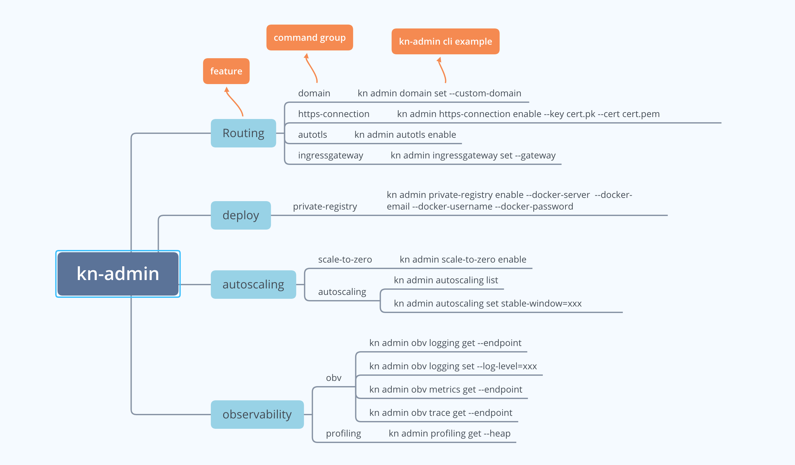

# kn-admin
A plugin for kn client for management

* This repo is under development.

## kn-admin Design


## kn-admin Usage
```bash
 ./kn-admin -h
A plugin of kn client to manage Knative for administrators. 

For example:
kn admin domain update - to update Knative route domain to a custom domain
kn admin https-connection enable - to enable https connection for Knative Service
kn admin private-registry enable - to enable deployment from the private registry
kn admin scale-to-zero enable - to enable scale to zero
kn admin obv profiling get -heap - to get Knative Serving profiling data

Usage:
  admin [command]

Available Commands:
  autoscaling-config Manage autoscaling config
  autotls            Manage autotls with Cert Manager
  domain             Manage Knative route domain
  help               Help about any command
  ingressgateway     Manage Ingress Gateway
  obv                Manage Observability
  private-registry   Manage private-registry
  scale-to-zero      Manage feature of scale to zero

Flags:
      --config string   config file (default is $HOME/.kn-admin.yaml)
  -h, --help            help for admin
  -t, --toggle          Help message for toggle

Use "admin [command] --help" for more information about a command.
```

